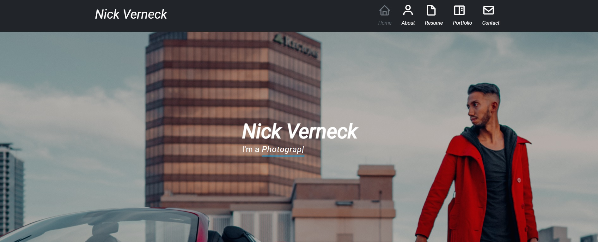
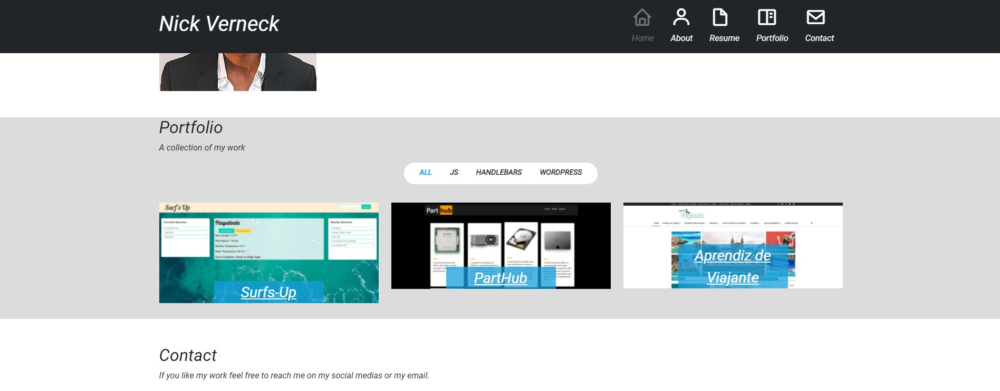

# Portfolio
My portfolio page using bootstrap and some JS libraries for some visual effects.

### live link https://nickverneck.github.io/Porfolio-2/

## Table of Contents 
* [Installation](#installation)
* [Questions](#questions)
## Installation
there is no dependencies, just open the index.html or copy to your public folder on your server.
## Questions
If you have any questions about the repo, open an issue or contact me directly at nicollas@gmail.com. 
You can find more of my work at [nickverneck](https://github.com/nickverneck/).

